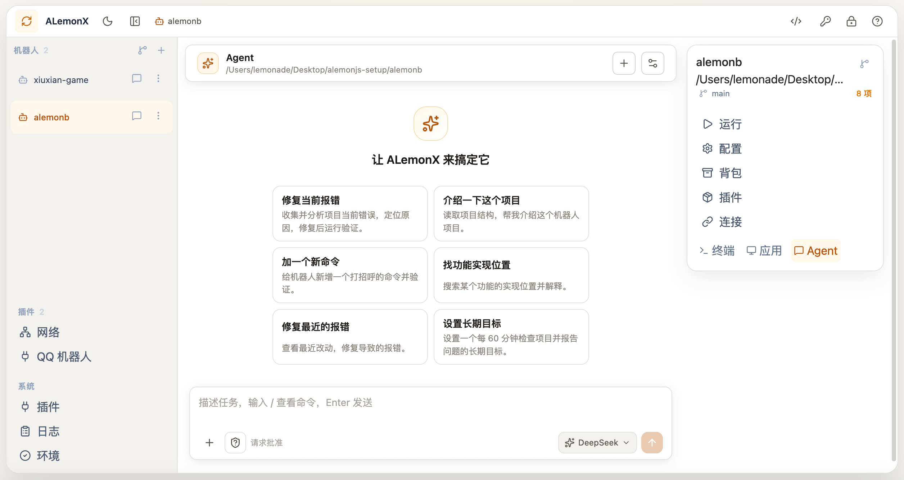

# ALemonX · 机器人的本地工作台

> 创建、运行、管理和扩展 AlemonJS 机器人；也能让 AI Agent 在你的确认下协助维护项目。

[下载最新版](https://github.com/lemonade-lab/alemonx/releases) · [MCP 文档](docs/mcp.md) · [系统插件开发](docs/plugin-development.md)



ALemonX（`alx`）将 AlemonJS 机器人的环境检查、项目导入、配置、运行日志、插件、连接、Git 与发布收进同一个本地工作台。

## 能做什么

- 用引导创建机器人，或导入本地项目、从 GitHub/Gitee 克隆仓库。
- 管理运行、依赖检查、日志与 PM2。
- 配置连接、插件、本地 `packages/` 与发布信息。
- 通过受控 MCP 让 Codex 等 AI Agent 协作维护项目。

## 开始使用

从 [GitHub Releases](https://github.com/lemonade-lab/alemonx/releases) 下载对应系统的压缩包并解压：

| 系统 | 下载文件 |
| --- | --- |
| Windows 64 位 | `alx-windows-amd64.zip` |
| macOS Apple Silicon | `alx-darwin-arm64.zip` |
| macOS Intel | `alx-darwin-amd64.zip` |
| Linux 64 位 | `alx-linux-amd64.zip` |

Windows 直接运行 `alx.exe`。macOS / Linux：

```bash
chmod +x alx
./alx
```

在浏览器打开终端显示的本地地址（默认 `http://127.0.0.1:17390`），即可开始创建、部署或管理机器人。

## 操作可控

完整能力范围与权限边界见 [MCP 控制面文档](docs/mcp.md)。

## 本地开发

需要 Go 1.23+、Node.js 22+ 与 Yarn 1.x：

```bash
go run .

cd frontend
yarn install
yarn dev
```

常用校验：

```bash
make test
make build
cd frontend && yarn lint && yarn build
```

## 文档

- [MCP 控制面](docs/mcp.md)
- [系统插件开发](docs/plugin-development.md)
- [插件 WebView 规范](docs/webview.md)
